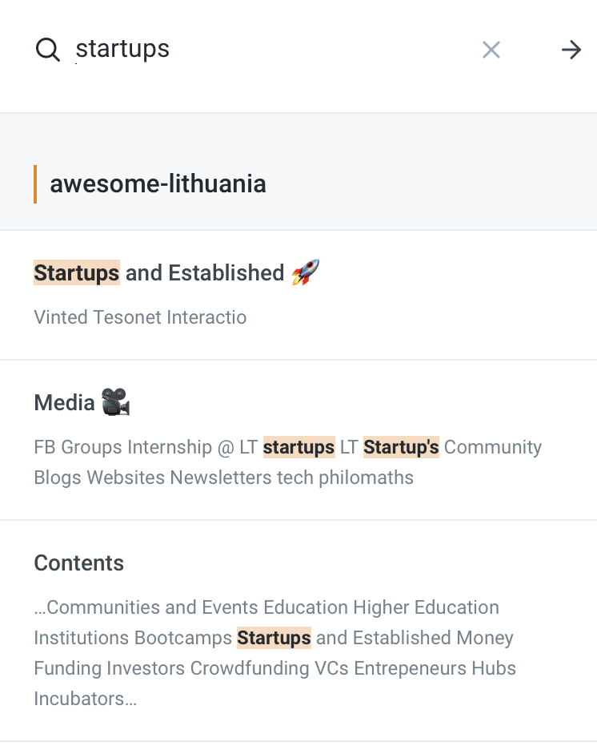

# Welcome

## &lt;who are we&gt;

This a new project, welcome on board and feel free to contribute 👋 

If you have any ideas or feedback feel free to submit issues. For business inquiries, contributors can also be contacted personally.

To suggest changes, click the GitHub icon on any docs page and make a pull request. If you're not sure how to do that, read our contributing [guide]()

If you can't find the answer you're looking for, contact us at [support@opencollective.com](mailto:support@opencollective.com) or at discord/slack

## Find your way to the right page

### Reading more about our community

Read our **Terminology** page to know more about all key members of our community:



### Using our search bar

Use the search bar on the top right to search for specific words or phrases:

### Browsing sections

Want to know more about Open Collective? Read our **About** section:



Interested in reading more about Open Collective's features? Go to our **Product** section:



## 

